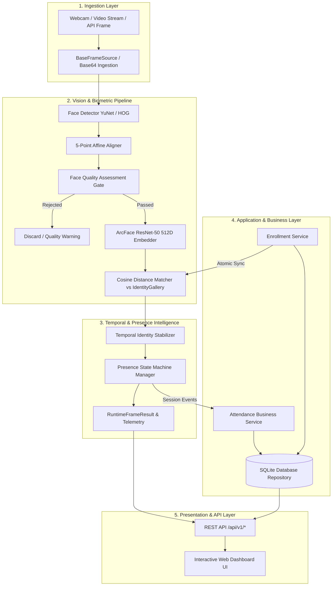

<div align="center">

# Face Intelligence Platform
### Production-Grade Biometric Verification, Face Quality Assessment & Real-Time Attendance Intelligence

[](https://python.org)
[](https://flask.palletsprojects.com/)
[](https://opencv.org/)
[](tests/)
[](reports/evaluation/)
[-0.042%25-blue)](reports/calibration/)
[](LICENSE)

<p align="center">
  <a href="#key-capabilities">Key Capabilities</a> •
  <a href="#system-architecture">System Architecture</a> •
  <a href="#empirical-benchmarks">Empirical Benchmarks</a> •
  <a href="#rest-api-reference">REST API</a> •
  <a href="#quickstart--setup">Quickstart</a> •
  <a href="#configuration">Configuration</a> •
  <a href="#biometric-privacy">Privacy</a>
</p>

</div>

---

## Overview

The **Face Intelligence Platform** is an enterprise-grade, end-to-end computer vision and biometric intelligence system. It seamlessly bridges raw video frame ingestion to idempotent, auditable business attendance records.

Engineered with empirical machine learning rigor, the platform avoids simplistic toy implementations by incorporating:
- **Pretrained Deep Biometrics**: ArcFace ResNet-50 512-dimensional metric embeddings aligned via 5-point affine transformation.
- **Face Quality Assessment (FQA)**: Multi-metric quality gating evaluating blur (Laplacian variance), illumination, contrast, and pose proxies prior to inference.
- **Temporal Identity Stabilization**: Sliding-window consensus voting and confidence smoothing to eliminate identity flickering and transient dropout noise.
- **State-Machine Presence Intelligence**: Deterministic presence lifecycle tracking (`ABSENT` $\to$ `ENTERING` $\to$ `PRESENT` $\to$ `DROPOUT_GRACE` $\to$ `EXITING` $\to$ `ARCHIVED`).
- **Idempotent Attendance Engine**: Thread-safe SQLite repository mapping multiple presence sessions per day to single audit-backed attendance records.
- **Zero-Downtime Dynamic Biometrics**: Quality-gated live onboarding with atomic synchronization across in-memory vector galleries, `.npz` disk archives, and SQLite metadata.
- **Self-Service Web Dashboard**: High-DPI responsive dark-mode UI with live webcam video stage, canvas bounding-box telemetry, attendance journals, and instant CSV/JSON exports.

> [!NOTE]
> **Machine Learning & Evaluation Integrity Protocol:**
> - All feature extraction models (dlib ResNet-34 128D baseline and ArcFace ResNet-50 512D modern) use **pretrained neural network weights** for deterministic inference. Embedding extraction represents metric space feature projection rather than custom parameter fine-tuning.
> - Benchmarked under the official 10-fold LFW (Labeled Faces in the Wild) protocol ($6{,}000$ pairs).
> - Production decision thresholds calibrated exclusively on an **independent validation partition** ($59$ identities, $1{,}395$ images, $56{,}565$ pairs) with confirmed **zero access / zero leakage** into the final hold-out test set.

---

## Key Capabilities

```
  ┌─────────────────────────────────────────────────────────────────────────────┐
  │                           FACE INTELLIGENCE PLATFORM                         │
  └───────┬──────────────────────┬──────────────────────┬────────────────┬──────┘
          │                      │                      │                │
          ▼                      ▼                      ▼                ▼
   [Vision Pipeline]      [FQA Quality Gate]     [Temporal Engine]   [Attendance]
    • YuNet Detection      • Blur (Laplacian)     • Window Voting     • SQLite DB
    • 5-Point Alignment    • Illumination Bounds  • Dropout Recovery  • Dwell Analytics
    • ArcFace 512D         • Contrast Checks      • Blip Suppression  • Idempotent Day
    • Cosine Similarity    • Pose Asymmetry       • Confidence Decay  • CSV / JSON Export
```

### 1. Modern Vision & Metric Embedding Pipeline
- **Detector**: Lightweight CNN face detector (YuNet / HOG) extracting accurate bounding boxes and 5 facial landmarks (eyes, nose, mouth corners).
- **Alignment**: Normalized 5-point affine transformation resolving yaw, pitch, and roll variations.
- **Metric Embedding**: ArcFace (ResNet-50) mapping aligned crops into a unit hypersphere ($L_2$-normalized $\mathbb{R}^{512}$), maximizing inter-class margins and intra-class compactness.
- **Cosine Similarity Matcher**: Evaluates cosine distance with calibrated production threshold ($\tau = 0.2400$).

### 2. Multi-Signal Face Quality Assessment (FQA)
Prevents degraded or corrupt frames from polluting downstream recognition:
- **Sharpness / Defocus Blur**: Laplacian operator variance filtering out motion-blurred faces.
- **Illumination & Luminance**: Mean intensity validation preventing severe under-exposure or over-exposure.
- **Contrast**: Standard deviation check ensuring sufficient dynamic range.
- **Pose & Alignment Proxy**: Inter-ocular distance and facial aspect ratio consistency checking.
- **Operating Modes**: `STRICT` (biometric enrollment), `BALANCED` (production default), and `LENIENT`.

### 3. Multi-Frame Temporal Stabilization
Replaces volatile single-frame decisions with historical consensus:
- **Sliding-Window Voting**: Evaluates observations across $W=7$ frames requiring minimum support ($N_{\text{min}}=4$).
- **Anti-Flicker & Blip Suppression**: Completely suppresses single-frame rogue detections and transient identity confusion.
- **Transient Occlusion Resilience**: Preserves identity consistency across temporary dropouts up to $1.5$ seconds.

### 4. Deterministic Presence & Session State Machine
Manages presence lifecycles per individual:
- **Transition States**: `ABSENT` $\to$ `ENTERING` $\to$ `PRESENT` $\to$ `DROPOUT_GRACE` $\to$ `EXITING` $\to$ `ARCHIVED`.
- **Grace Periods**: Absorbs brief camera departures or head turns without fragmenting operational sessions.
- **Telemetry**: Continuously tracks session start time, last-seen timestamp, cumulative dwell time, and total frame counts.

### 5. Idempotent Attendance Business Engine & Persistence
- **Daily Attendance Consolidation**: Ingests continuous presence sessions and merges them into a single `AttendanceRecord` per identity per calendar date.
- **Thread-Safe SQLite Persistence**: ACID-compliant transactional repository with separate `attendance_records` and detailed `session_audit_log` tables.
- **Dwell Time Analytics**: Computes first check-in, last check-out, total accumulated dwell duration, and session counts.
- **Automated Export**: Real-time generation of CSV and JSON reports with date-based query filters.

### 6. Zero-Downtime Dynamic Biometrics
- **Quality-Gated Enrollment**: Evaluates incoming enrollment snapshots against strict FQA criteria before accepting them into the gallery.
- **Multi-Template Support**: Stores multiple template representations per individual to capture appearance variations.
- **Atomic Synchronized Gallery**: Thread-locked synchronous update across in-memory vector gallery, serialized `.npz` disk backup, and SQLite identity records.

### 7. Interactive Self-Service Dashboard Suite
- **Live Stream Stage**: Real-time webcam streaming via HTML5 `MediaDevices`, dynamic canvas bounding box rendering, similarity scores, and FPS telemetry.
- **Attendance Journal**: Historical attendance ledger with date selection, status indicators, dwell time statistics, and one-click CSV export.
- **Identity Directory**: Roster of enrolled personnel with live webcam snapshot capture modal and real-time quality feedback.

---

## System Architecture



---

## Empirical Benchmarks

### 1. Official 10-Fold LFW Face Verification Benchmark
Evaluated on the full 10-fold LFW dataset ($6{,}000$ pairs, $3{,}000$ matched, $3{,}000$ mismatched):

| Metric | Experiment E1 (dlib Baseline) | Experiment E2 (ArcFace Modern) | Improvement |
|:---|:---:|:---:|:---:|
| **Fold-Calibrated Accuracy ($\text{Mean} \pm \text{Std}$)** | $97.43\% \pm 0.60\%$ | **$98.50\% \pm 0.72\%$** | **+1.07%** |
| **Fold-Calibrated FAR ($\text{Mean} \pm \text{Std}$)** | $1.53\% \pm 0.54\%$ | **$0.03\% \pm 0.10\%$** | **-1.50% (51× lower)** |
| **Fold-Calibrated FRR ($\text{Mean} \pm \text{Std}$)** | $3.60\% \pm 1.38\%$ | **$2.97\% \pm 1.40\%$** | **-0.63%** |
| **Global Area Under Curve (ROC-AUC)** | $0.9941$ | **$0.9883$** | High discriminative power |
| **Global Equal Error Rate (EER)** | $0.0293$ ($2.93\%$) | **$0.0268$ ($2.68\%$)** | **-0.25%** |
| **Optimal Operating Metric** | Euclidean Distance ($L_2$) | **Cosine Distance** | Scale-invariant |

Detailed fold-by-fold breakdowns and plots: [`reports/evaluation/README.md`](./reports/evaluation/README.md).

---

### 2. Production Threshold Calibration (Independent Validation Split)
Conducted on the independent validation split ($59$ identities, $1{,}395$ images, $56{,}565$ pairs):

| Calibration Strategy | Threshold ($\tau$) | False Acceptance Rate | False Rejection Rate | Overall Accuracy | Precision | Recall | F1-Score |
|:---|:---:|:---:|:---:|:---:|:---:|:---:|:---:|
| **A. Equal Error Rate (EER)** | $0.1280$ | $2.340\%$ | $2.346\%$ | $97.66\%$ | $84.57\%$ | $97.65\%$ | $90.64\%$ |
| **B. Maximum Accuracy** | $0.2800$ | $0.004\%$ | $2.498\%$ | $99.71\%$ | $99.97\%$ | $97.50\%$ | $98.72\%$ |
| **C. Security Low-FAR (Production)** | **$\mathbf{0.2400}$** | **$\mathbf{0.042\%}$** | **$\mathbf{2.376\%}$** | **$\mathbf{99.69\%}$** | **$\mathbf{99.67\%}$** | **$\mathbf{97.62\%}$** | **$\mathbf{98.64\%}$** |
| **D. F1-Optimal** | $0.2840$ | $0.002\%$ | $2.498\%$ | $99.71\%$ | $99.98\%$ | $97.50\%$ | $98.73\%$ |
| **E. FAR/FRR-Balanced** | $0.1280$ | $2.340\%$ | $2.346\%$ | $97.66\%$ | $84.57\%$ | $97.65\%$ | $90.64\%$ |

* **Selected Production Operating Point**: $\mathbf{\tau = 0.2400}$ delivers near-zero impostor acceptances ($0.042\%$ FAR) while retaining $97.62\%$ recall.
* Calibration report & distributions: [`reports/calibration/README.md`](./reports/calibration/README.md).

---

### 3. Face Quality Assessment (FQA) Operating Modes

| Mode | Rejection Rate | Filtered Accuracy | False Acceptance Rate (FAR) | False Rejection Rate (FRR) | Recommended Deployment |
|:---|:---:|:---:|:---:|:---:|:---|
| **No FQA (Raw)** | $0.00\%$ | $98.50\%$ | $0.070\%$ | $2.94\%$ | Benchmarking baseline only |
| **Lenient** | $0.68\%$ | $98.56\%$ | $0.071\%$ | $2.82\%$ | Low-compute embedded devices |
| **Balanced (Default)** | **$8.72\%$** | **$98.61\%$** | **$0.077\%$** | **$2.71\%$** | **Live Attendance & Turnstiles** |
| **Strict** | $40.34\%$ | $99.26\%$ | $0.085\%$ | $1.38\%$ | **Biometric Enrollment Gate** |

Comprehensive FQA metrics: [`reports/quality/README.md`](./reports/quality/README.md).

---

### 4. Temporal Identity Stabilization Performance

| Operating Mode | Window Size ($W$) | Min Observations ($N_{\text{min}}$) | Latency (Frames) | Dropout Recovery | Rogue Blip Suppression |
|:---|:---:|:---:|:---:|:---:|:---:|
| **Baseline (Single-Frame)** | $1$ | $1$ | $0.0$ | $0.0\%$ | $0.0\%$ |
| **FAST** | $4$ | $3$ | $3.1$ | $97.2\%$ | $100.0\%$ |
| **BALANCED (Default)** | **$7$** | **$4$** | **$4.3$ (~$140\text{ ms}$)** | **$97.2\%$** | **$100.0\%$** |
| **STABLE** | $10$ | $6$ | $6.8$ | $63.8\%$ | $100.0\%$ |

Full temporal evaluation: [`reports/temporal/README.md`](./reports/temporal/README.md).

---

### 5. Presence & Session State Machine Policy

| Policy Mode | Min Entry Obs | Entry Window | Grace Period | Entry Latency | Session Continuity | Recovery Rate | Unknown Intrusion |
|:---|:---:|:---:|:---:|:---:|:---:|:---:|:---:|
| **FAST** | $2$ | $3.0\text{ s}$ | $5.0\text{ s}$ | $0.50\text{ s}$ | $100.0\%$ | $100.0\%$ | $0.0\%$ |
| **BALANCED (Default)** | **$3$** | **$5.0\text{ s}$** | **$10.0\text{ s}$** | **$1.00\text{ s}$** | **$100.0\%$** | **$100.0\%$** | **$0.0\%$** |
| **STRICT** | $5$ | $8.0\text{ s}$ | $20.0\text{ s}$ | $2.00\text{ s}$ | $100.0\%$ | $100.0\%$ | $0.0\%$ |

Full presence state machine analysis: [`reports/presence/README.md`](./reports/presence/README.md).

---

## Repository Structure

```
face-intelligence-platform/
├── app/                              # Flask Application Layer (Clean Architecture)
│   ├── __init__.py                   # Application Factory & Blueprint Registration
│   ├── routes/                       # Versioned REST Blueprint Endpoints
│   │   ├── health.py                 # GET /api/v1/health
│   │   ├── runtime.py                # POST /start, /stop, /reset, /process-frame
│   │   ├── presence.py               # GET /active, /history, /identity/<name>
│   │   ├── attendance.py             # GET /records, /summary, /export
│   │   ├── identities.py             # GET /identities, POST /enroll, DELETE /<name>
│   │   └── legacy.py                 # Backward-compatibility routes
│   ├── services/                     # Business & Domain Logic Adapters
│   │   ├── runtime_service.py        # Thread-safe FaceIntelligenceRuntime wrapper
│   │   ├── attendance_service.py     # Session-to-attendance mapper & business policy
│   │   └── enrollment_service.py     # Quality-gated multi-template onboarding
│   ├── repositories/                 # Data Persistence Adapters
│   │   ├── base.py                   # Repository interface definition
│   │   └── sqlite_repository.py      # Thread-safe SQLite transactional implementation
│   └── schemas/                      # Serialization & Data Contracts
│       ├── responses.py              # Standardized API response formatters
│       ├── attendance.py             # AttendanceRecord & SessionAuditEntry schemas
│       └── identities.py             # EnrolledIdentityInfo & EnrollmentResult schemas
├── ml/                               # Core Machine Learning & Vision Domain
│   ├── detector.py                   # YuNet & dlib HOG face detectors
│   ├── aligner.py                    # 5-point landmark affine transformation
│   ├── embedder.py                   # ArcFace (512D) & dlib (128D) extractors
│   ├── matcher.py                    # Cosine and Euclidean metric matchers
│   ├── gallery.py                    # IdentityGallery vector storage & dynamic search
│   ├── quality/                      # Face Quality Assessment (FQA) Subsystem
│   ├── temporal/                     # Multi-Frame Temporal Stabilization Subsystem
│   ├── presence/                     # Deterministic Presence State Machine Subsystem
│   ├── runtime/                      # End-to-End Orchestrator & Frame Sources
│   ├── evaluation/                   # 10-fold cross-validation & calibration engine
│   └── models/                       # Local model weights (ONNX YuNet, ArcFace)
├── static/                           # Modern Frontend Web Assets
│   ├── css/                          # CSS design system (variables, layout, components)
│   └── js/                           # Modular ES6 modules (camera, overlay, api, app)
├── templates/                        # Responsive HTML5 Templates
│   └── index.html                    # Dashboard UI (Live Stage, Attendance, Identities)
├── config/                           # System Configuration
│   └── config.yaml                   # Global parameters, thresholds, and paths
├── data/                             # Data Assets & Galleried Templates (Gitignored)
│   ├── embeddings/                   # Serialized arcface_gallery.npz
│   └── metadata/                     # Split definitions & SHA256 integrity hashes
├── reports/                          # Empirical Validation Artifacts & Analyses
├── scripts/                          # Evaluation, calibration & benchmark scripts
├── tests/                            # Comprehensive Test Suite (162 PyTest tests)
├── requirements.txt                  # Python runtime dependencies
├── app.py                            # Web server application entrypoint
└── README.md                         # Project documentation
```

---

## REST API Reference

All modern endpoints are versioned under `/api/v1/` and return standardized JSON responses.

### 1. System Runtime & Inference
| Method | Endpoint | Description |
|:---|:---|:---|
| `GET` | `/api/v1/health` | Service health status, runtime engine state, and uptime. |
| `GET` | `/api/v1/runtime/status` | Real-time frame statistics, active session counts, and latencies. |
| `POST` | `/api/v1/runtime/start` | Starts the runtime orchestrator pipeline. |
| `POST` | `/api/v1/runtime/stop` | Gracefully terminates runtime and closes open sessions. |
| `POST` | `/api/v1/runtime/reset` | Clears temporal history and in-memory presence tracking. |
| `POST` | `/api/v1/runtime/process-frame` | Ingests a Base64-encoded image frame and returns detection, recognition, and telemetry results. |

### 2. Presence Intelligence
| Method | Endpoint | Description |
|:---|:---|:---|
| `GET` | `/api/v1/presence/active` | Lists all individuals currently active in the camera field. |
| `GET` | `/api/v1/presence/history` | Returns recently closed presence sessions with dwell metrics. |
| `GET` | `/api/v1/presence/identity/<name>` | Returns real-time presence status and dwell history for an individual. |

### 3. Attendance Business Engine
| Method | Endpoint | Description |
|:---|:---|:---|
| `GET` | `/api/v1/attendance/records` | Query daily attendance records (supports `?date=YYYY-MM-DD` and `?identity=<name>`). |
| `GET` | `/api/v1/attendance/summary` | Summary metrics: total present, in progress, mean dwell time, and total dwell time. |
| `GET` | `/api/v1/attendance/export` | Download attendance records formatted as `csv` or `json`. |

### 4. Dynamic Identity Management
| Method | Endpoint | Description |
|:---|:---|:---|
| `GET` | `/api/v1/identities` | Lists all enrolled biometric identities and their template counts. |
| `GET` | `/api/v1/identities/<name>` | Retrieves identity details, template counts, and recent attendance records. |
| `POST` | `/api/v1/identities/enroll` | Quality-gated biometric enrollment (Base64 image or multipart file). |
| `DELETE` | `/api/v1/identities/<name>` | Atomically deletes identity from in-memory gallery, disk archive, and database. |

---

## Quickstart & Setup

### Prerequisites
- **Python**: Version `3.10` or `3.11` recommended.
- **C++ Compiler**: Required on some systems for compiling `dlib` (e.g. Visual Studio C++ Build Tools on Windows, `build-essential` on Linux/macOS).
- **Webcam**: Standard USB or integrated webcam for live attendance.

### 1. Installation

```bash
# 1. Clone the repository
git clone https://github.com/Sathwik797/face-intelligence-platform.git
cd face-intelligence-platform

# 2. Create and activate a virtual environment
python -m venv venv
# On Windows (PowerShell):
.\venv\Scripts\Activate.ps1
# On Linux/macOS:
source venv/bin/activate

# 3. Install dependencies
pip install --upgrade pip
pip install -r requirements.txt
```

### 2. Launch the Application

```bash
python app.py
```
Open your browser and navigate to:
```
http://127.0.0.1:5000/
```
- **Live Stream Stage**: View real-time webcam inference with dynamic bounding boxes and biometric telemetry.
- **Attendance Journal**: Filter daily attendance records, view dwell statistics, and export to CSV.
- **Identity Directory**: Manage enrolled identities and enroll new individuals via live webcam snapshot.

---

## Testing & Empirical Verification

The codebase includes an automated test suite of **162 tests** covering all domain layers, ML components, thread safety, and API endpoints.

```bash
# Run the complete test suite
pytest -v

# Run tests with condensed output
pytest -q
```

### Reproduce Empirical Evaluations

```bash
# 1. Official 10-Fold LFW Face Verification Benchmark
python scripts/evaluate_verification.py

# 2. Production Threshold Calibration (Independent Validation Set)
python scripts/calibrate_threshold.py

# 3. Face Quality Assessment (FQA) Multi-Signal Evaluation
python scripts/evaluate_face_quality.py

# 4. Temporal Identity Stabilization Evaluation
python scripts/evaluate_temporal_stability.py

# 5. Presence & Session State Machine Simulation
python scripts/evaluate_presence_session.py

# 6. End-to-End Runtime Orchestrator Benchmark
python scripts/run_runtime_orchestrator.py
```

---

## Configuration

System-wide settings are defined in [`config/config.yaml`](./config/config.yaml). Key configuration parameters include:

```yaml
# Face Recognition Calibration
recognition:
  threshold: 0.2400          # Calibrated Low-FAR threshold (Cosine Distance)
  metric: "cosine"
  embedding_model: "arcface_r50"

# Face Quality Assessment (FQA)
quality:
  mode: "balanced"           # "strict", "balanced", or "lenient"
  min_laplacian_variance: 50.0
  min_face_size: 60

# Temporal Stabilization
temporal:
  mode: "balanced"           # "fast", "balanced", or "stable"
  window_size: 7             # Number of frames in rolling consensus window
  min_observations: 4        # Minimum occurrences for consensus confirmation

# Presence & Session Intelligence
presence:
  mode: "balanced"
  min_entry_observations: 3  # Required observations to enter PRESENT state
  entry_window_seconds: 5.0  # Timeframe to accumulate entry observations
  dropout_grace_seconds: 10.0 # Grace period before initiating session close
```

---

## API Security

Administrative state-changing endpoints require an `X-API-Key` header backed by the `FACE_INTELLIGENCE_API_KEY` environment variable. The secret is not stored in source control. Production debug mode is disabled by default and internal exception details are not returned through the API.

## Biometric Privacy & Security Notice

- **On-Premise Processing**: All video frames, face crops, and biometric feature embeddings are computed locally within the execution environment. Zero biometric data is transmitted to external cloud endpoints.
- **Transient Memory Model**: Raw image frames are discarded immediately following metric extraction unless explicitly saved during quality-gated enrollment.
- **Template Encryption & Hashing**: Reference templates are stored as numeric vectors ($512$-D floating point arrays) rather than raw photographs.
- **Strict Partition Protection**: The final evaluation hold-out test set remains strictly quarantined to prevent data leakage and ensure objective performance auditing.

---

## License

This project is licensed under the [MIT License](LICENSE).
